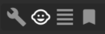
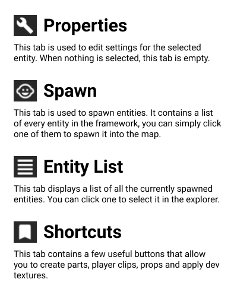

# 2. Plugin Overview
> If you experience any issues with the plugin, they can most likely be fixed by reloading the plugin or restarting studio.

### Toolbar
The toolbar is displayed at the top of the Index Editor widget. It's function is to navigate between different tabs of the editor. Below is a list of each toolbar button and
what they do.

