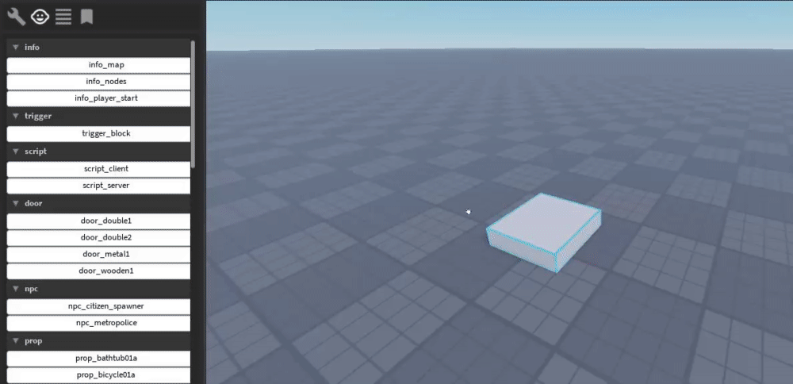

# 3. Player Spawn
One of the most essential entities is 'info_player_start'. It tells the game where to spawn the player and what way they should be facing. This is generally the first thing you'll spawn when starting a new project.

> If your map has multiple spawns, the player will spawn at a random one.

1. Navigate to the spawn tab in the Index Editor and click on 'info_player_start' (it should be near the top of the list). This should spawn the entity into the map.
2. Position the entity where you want the player to spawn (use the default movement tools).
3. Now start the game. You will see a loading screen and then you should spawn where you placed the 'info_player_start'.

Next: [Building](/ifw/4_building)