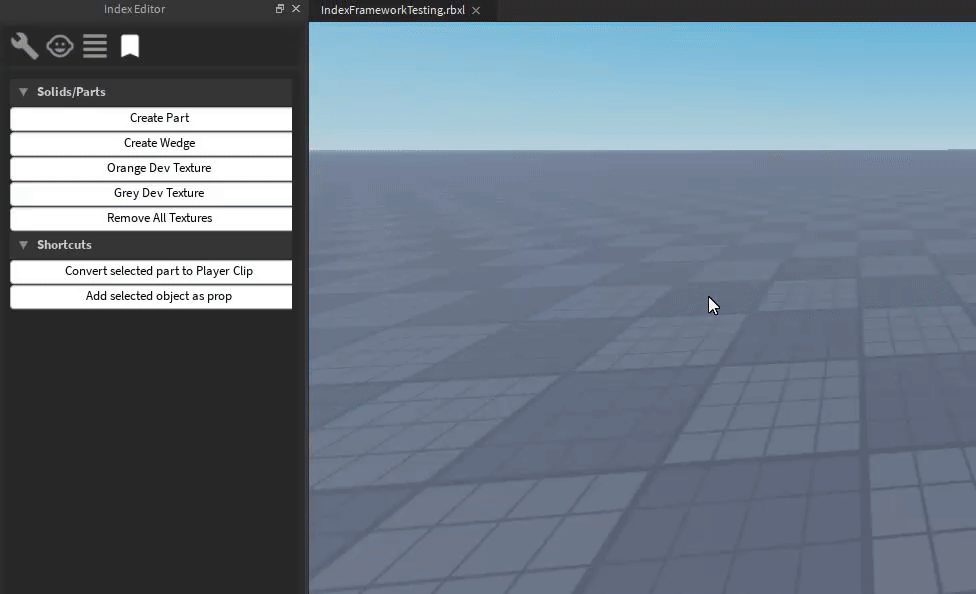

# 4. Building
Index Framework has a few tools to help you build simple map geometry. In the shortcuts tab of the Index Editor, you can create parts or wedges. You can also apply dev textures to the currently selected part.

> We recommended setting your move snapping to 0.5 studs, as our grid squares are 1 stud each.

Next: [Props](/ifw/5_props)